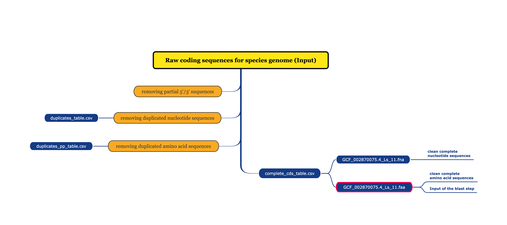

# CDS_datamining_annotation
This project aim to clean and parse coding sequences from genomic (cds) with any species genome that available in [NCBI genome dataset](https://ftp.ncbi.nlm.nih.gov/genomes/), then using clean, treanslated amino acid sequences to do gene annotation with [pre-formatted blast database](https://ftp.ncbi.nlm.nih.gov/blast/db/) (e.g. landmark database is recommended) by [blastp](https://blast.ncbi.nlm.nih.gov/Blast.cgi?PAGE=Proteins).<br/>

The procedure includes three steps:
- coding sequences cleaning, structuring, and  translation
- gene annotation with blastp by installing [BLAST+ executables](https://ftp.ncbi.nlm.nih.gov/blast/executables/blast+/LATEST/) or using [ncbi/blast](https://hub.docker.com/r/ncbi/blast/tags) docker image by executing docker command on ubuntu system.
- save gene annotation output in sqlite

```
python3 main.py -h
usage: main.py [-h] [--sql_dir SQL_DIR] CDS_filepath Output_folder_name Output_fna_filename

positional arguments:
  CDS_filepath         Filepath of target CDS, the file format need to be '.fasta' ,'.fna', or '.fsa'.
  Output_folder_name   Name a folder for saving all output data.
  Output_fna_filename  Name your clean cds fasta file.

options:
  -h, --help           show this help message and exit
  --sql_dir SQL_DIR    The filepath and name of the sqlite dataset you want to save your blastp outputs.
```

## Step1: coding sequences cleaning, structuring, and  translation
- preparation: your own genome dataset or download cds from target species genome in [NCBI genome dataset](https://ftp.ncbi.nlm.nih.gov/genomes/)
- workflow

  </img>


## Step2: gene annotation with blast (Basic Local Alignment Search Tool)
### preparation
  - clean amino acid fasta file (.faa file in first step)
  - installing [BLAST+ executables](https://ftp.ncbi.nlm.nih.gov/blast/executables/blast+/LATEST/) or using install [Docker](https://www.docker.com/get-started/) and perform blastp with [ncbi/blast](https://hub.docker.com/r/ncbi/blast/tags) docker image (need to be ubuntu enviroment)
  - download the preformatted database provided by NCBI or generate customized database by blastdbcmd command in [BLAST+ executables(https://ftp.ncbi.nlm.nih.gov/blast/executables/blast+/LATEST/)
     - by BLAST+ executables on your local enviroment
       ```
       # show all preformatted database on NCBI
       update_blastdb.pl --showall pretty
     
       # download the target preformatted database [db]
       update_blastdb.pl --decompress [db name]
       ```
     - by docker image ncbi/blast in ubuntu environment
       - NCBI provided an [instruction](https://github.com/ncbi/blast_plus_docs) about how to create an vm and execute blast on Google Cloud Platfrom(GCP)
       - Note: recommend to use ncbi/blast:2.14.0 instead of ncbi/blast:2.15.0 because some bug occured when using -taxids optional argument in blastp
       ```
       # show all preformatted database on NCBI
       sudo docker run --rm ncbi/blast:2.14.0 update_blastdb.pl --showall pretty
     
       # download the target preformatted database [db]
       sudo docker run --rm -v [local path of saving db]:[docker path of saving db]:rw -w [docker path of saving db] ncbi/blast:2.14.0 update_blastdb.pl --source [ncbi/gcp] [db name]
       ```
    - settings
      You can/should customized the **blastp** section in config.ini:
      - using_docker: if you are going to use docker image, please assign this parameter as “1", "yes", "true", or "on"; and if you are going to use BLAST+ executables on your local environment, please assign this parameter as "0", "no", "false", and "off".
      - db_folder: specifying the directory of the formatted database(db)
      - db_name: the name of your database
      - max_target_seqs: the maximum queries you want to extracts from the queries that match the criteria
      - num_threads: how many threads you want to use to run your blast program (depends on your system, usually 4 to 32), more threads can perform blast more efficiently, relatively estimated time describled in [NCBI publication](https://www.ncbi.nlm.nih.gov/books/NBK571452/).
      - evalue: the threshold of the evalue of blast alignment result
      - taxids: [limiting your search by taxonomy](https://www.ncbi.nlm.nih.gov/books/NBK569846/), this could save lots of time if your database included lots of different species, and you could constraint the program only align with the species that is homologous with your reserch objective.
## Step3: save gene annotation output in sqlite
## How to use this package
- Executing step1 & step2 first, then add --sql_dir optional argument to execute step 3 and save blastp result in sqlite
  ```
       # Executing main.py without --sql_dir optional argument to perform step1 and step2
       python3 main.py [CDS_filepath] [Output_folder_name] [Output_fna_filename]
     
       # Executing main.py again with --sql_dir optional argument to perform step3 to save blastp result in sqlite
       python3 main.py [CDS_filepath] [Output_folder_name] [Output_fna_filename] --sql_dir [sql_name]
  ```
